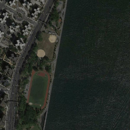
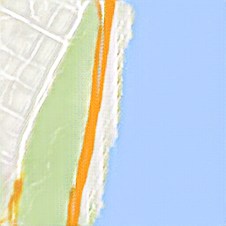

# Pix2Pix Implementation with CGAN on Maps Dataset

## Overview
This project implements the Pix2Pix framework for image-to-image translation using Conditional Generative Adversarial Networks (CGANs). The task is trained on the Maps Dataset, which contains paired satellite map images and corresponding street map images. The implementation enables the conversion between these two modalities, providing an effective approach for tasks such as cartography, urban planning, and visualization.

## Dataset
**Dataset Name:** [Pix2Pix Dataset](https://www.kaggle.com/datasets/vikramtiwari/pix2pix-dataset?resource=download-directory)

### Structure
- **Input Images:** Satellite maps.
- **Target Images:** Street maps.
- **Data Format:**
  - Images are paired in a side-by-side format.
  - Resolution: 256x256 pixels.

### Preprocessing
- Split images into input-output pairs.
- Normalize pixel values to the range [-1, 1].

## Model Architecture
The Pix2Pix framework consists of two key components:

### Generator
- **Type:** U-Net with skip connections.
- **Architecture:**
  - Encoder: Downsampling layers to capture context.
  - Decoder: Upsampling layers with skip connections to preserve spatial information.
  - Activation: ReLU for intermediate layers and Tanh for the output layer.

### Discriminator
- **Type:** PatchGAN.
- **Architecture:**
  - Evaluates patches of size 30x30 pixels.
  - Outputs a matrix of probabilities indicating whether each patch is real or fake.

## Training
- **Objective Function:**
  - Generator Loss: Combination of L1 loss (to maintain pixel-level similarity) and adversarial loss.
  - Discriminator Loss: Binary cross-entropy loss for real vs. fake classification.
- **Optimization:** Adam optimizer with learning rate 2e-4 and β1 = 0.5.
- **Batch Size:** 16
- **Epochs:** 200
- **Training Procedure:**
  - Alternate updates to generator and discriminator.

## Results
- **Qualitative Results:**
  - Satellite maps are successfully translated into street maps with high fidelity.
  - Captures details such as roads, buildings, and water bodies.

### Example Outputs
| Input (Satellite Map) | Output (Predicted Street Map) |
|-------------------------------|-----------------------------------|
|   |          |

## Key Files
- `main.ipynb`: Main Notebook for Pix2Pix.

## References
- [Pix2Pix: Image-to-Image Translation with Conditional Adversarial Networks](https://arxiv.org/abs/1611.07004)
- Dataset: [Kaggle - Pix2Pix Dataset](https://www.kaggle.com/datasets/vikramtiwari/pix2pix-dataset?resource=download-directory)

